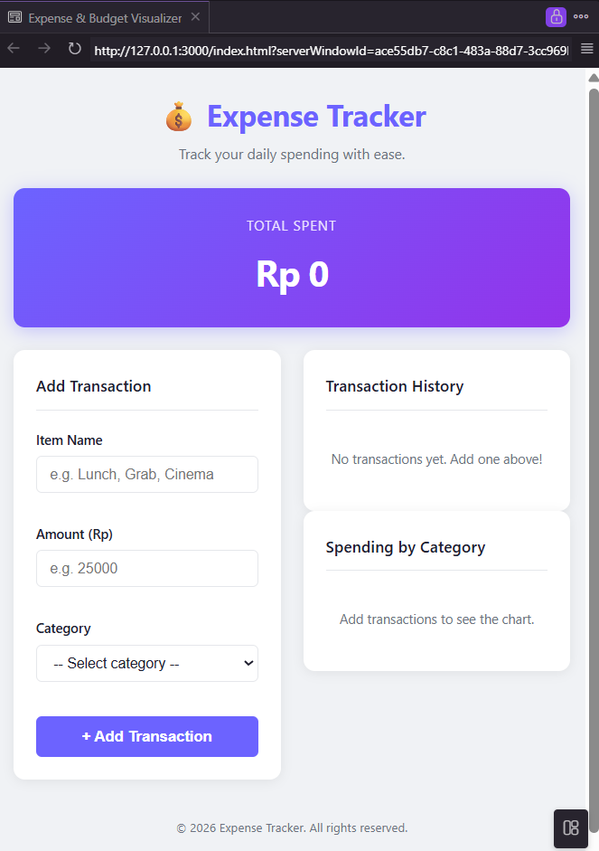

# Expense Tracker

A simple and responsive web application for tracking daily expenses. Users can add transactions, monitor total spending, and visualize expenses by category through an interactive pie chart.

## Preview



## Features

- Add and delete expense transactions
- Real-time total balance calculation
- Spending visualization with Chart.js
- LocalStorage data persistence
- Responsive design for desktop and mobile
- Form validation with inline error messages

## Built With

- **HTML5** – Page structure
- **CSS3** – Styling and responsive layout
- **Vanilla JavaScript (ES6+)** – Application logic
- **Chart.js** – Pie chart visualization
- **LocalStorage API** – Client-side data persistence

## Project Structure

```text
Expense-Tracker/
├── css/
├── js/
├── preview/
│   └── preview.png
├── design.md
├── requirements.md
├── index.html
└── README.md
```

## Getting Started

1. Clone this repository.

```bash
git clone https://github.com/andiniiadeliaa/CodingCamp-3August26-Andini-Adelia-Putri.git
```

2. Open the project folder.

3. Launch `index.html` in any modern web browser.

No installation or additional setup is required.

## Documentation

-  `requirements.md` — Functional and non-functional requirements.
-  `design.md` — Design documentation, UI layout, color palette, typography, and design decisions.

## Future Improvements

- Custom categories
- Monthly expense summary
- Search and filter transactions
- Dark mode
- Export transaction history

## Acknowledgements

This project was developed as part of the CodingCamp Software Engineering program to practice building a client-side web application using HTML, CSS, and Vanilla JavaScript.
